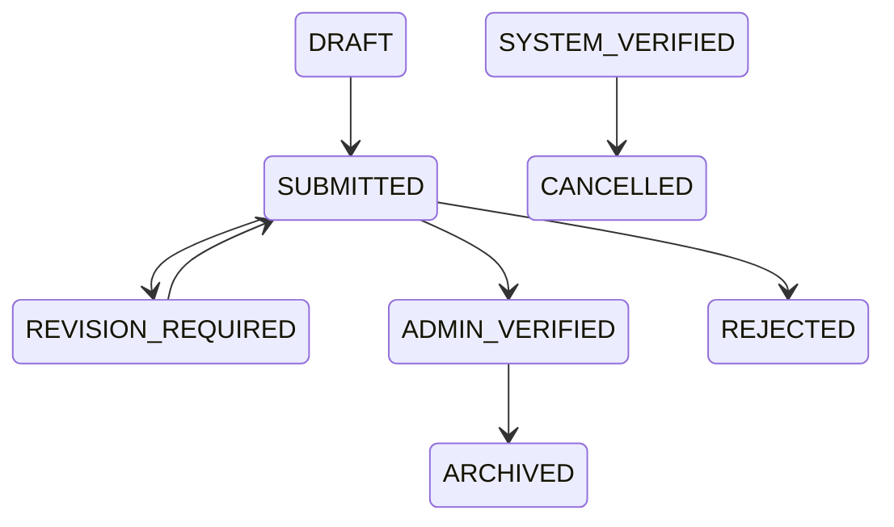

# Architecture

## Boundary

`dosen-farmasi` adalah aplikasi Laravel mandiri di dalam workspace. Ia membaca identitas dari `core-farmasi`, menerima event dari aplikasi sumber, dan menyimpan domain portofolio dosen dalam database lokalnya sendiri.

## Components

- Web portal dosen: dashboard, inbox, agenda, portofolio, dokumen, laporan pribadi, preferensi.
- Admin panel: Filament untuk verifikasi, data dosen lokal, kategori, integrasi, audit, laporan agregat.
- Core auth bridge: `CoreBridgeAuthService` memverifikasi kredensial Core secara read-only dan provisioning local `AppUser` tanpa password.
- Core directory adapter: lookup user/dosen/program studi via DB read-only atau HTTP app-client, default disabled sampai credential tersedia.
- Portfolio domain: category/type/activity/participant/tag/verification history.
- Document domain: metadata, versioning, private storage, checksum, download policy.
- Inbox/agenda domain: business inbox dan calendar event, bukan sekadar notification.
- Integration kernel: service clients, hashed tokens, event envelope, idempotency, handlers, failure/retry, sync cursors, pull adapters, and KP producer pilot support.
- Notification layer: database notification dan queued email berbasis preferensi.
- Audit layer: perubahan status, upload/download, role change, admin action, retry integrasi.

## Data Flow

1. Dosen login dengan kredensial Core.
2. Bridge membaca Core secara read-only, memverifikasi password dengan `Hash::check`, memastikan user aktif, bukan `must_change_password`, dan punya akses app.
3. App membuat/memperbarui local `app_users` tanpa password.
4. Dosen bekerja pada data lokal yang selalu difilter `core_lecturer_id`.
5. Source app mengirim event ke `/api/internal/v1/events`.
6. KP Farmasi pilot menulis outbox lokal dan delivery job mengirim push event setelah commit.
7. Jika push belum tersedia, pull adapter read-only membaca outbox canonical source app dan mengirim envelope ke ingestion service internal.
8. Event disimpan raw, divalidasi, lalu handler membuat atau memperbarui inbox, agenda, dokumen metadata, atau portofolio `SYSTEM_VERIFIED`.
9. Event duplikat tidak membuat efek ganda.
10. Notification/email dibuat setelah transaksi commit sesuai preferensi.

## Storage

Binary file disimpan di disk private configurable. Database hanya menyimpan metadata, checksum, versi, ownership, dan relasi domain. Download wajib melewati policy.

M1 menyediakan disk `shared_private` dengan fallback development ke `storage/app/dosen-private` dan command `php artisan dosen:storage-check`.

M2/M4-hardened upload memakai allowlist ekstensi, server MIME check, magic-byte/signature validation, validasi struktur Office zip, server-generated filename, checksum SHA-256, transaksi database, dan cleanup file jika transaksi gagal. Penghapusan metadata memakai soft delete; file fisik tidak dipurge oleh action pengguna biasa.

## Portfolio Status Workflow

`REJECTED` dikunci untuk MVP; dosen membuat aktivitas baru jika perlu perbaikan. Setiap transisi lewat `PortfolioStatusTransitionService`, memakai transaction, membuat `portfolio_verification_histories`, audit log, dan notification database.

`SYSTEM_VERIFIED` adalah data resmi dari sistem sumber. Field resmi tidak dapat diubah dosen; dosen hanya boleh mengelola catatan pribadi, visibility, dokumen tambahan, tag, dan issue report.

## Implemented Tables

- `app_users`
- `lecturer_snapshots`
- `portfolio_categories`
- `portfolio_activities`
- `documents`
- `activity_documents`
- `inbox_items`
- `inbox_recipients`
- `calendar_events`
- `calendar_event_attendees`
- `integration_clients`
- `integration_events`
- `integration_failures`
- `integration_sync_cursors`
- `notification_preferences`
- `audit_logs`
- `application_settings`
- `notifications`
- `portfolio_verification_histories`
- `portfolio_issue_reports`
- `portfolio_participants`
- `tags`
- `portfolio_activity_tag`
- `document_versions`

## Policy Matrix

- Dosen melihat dan mengelola data miliknya saja.
- Dosen mengedit aktivitas manual hanya saat `DRAFT` atau `REVISION_REQUIRED`.
- Admin melihat semua aktivitas dan menjalankan verifikasi/revisi/tolak/arsip via action.
- History read-only dan tidak dapat diedit/dihapus melalui policy.
- Dokumen resmi/source-app tidak dapat dihapus dosen.
- Inbox dan agenda difilter berdasarkan `lecturer_core_id`; multi-recipient/attendee disimpan sebagai grouped per-lecturer rows agar state tiap dosen independen.
- Internal integration API memakai hashed bearer token, active/revoked/expired checks, ability checks, dan source-app binding.
- Event source M5 memakai resolver identitas dosen direct Core ID lalu fallback NIP/NIDN/email/lecturer number dengan deteksi ambigu.
- Completion source app hanya membuat portofolio `SYSTEM_VERIFIED` setelah event resmi completion/finalized.
- KP changed events menutup inbox dosen lama agar assignment aktif tidak tertinggal pada dosen yang sudah diganti.

## Extension Points

- HTTP Core adapter selain DB read-only.
- Pull adapter per source app.
- Antivirus scan hook.
- Public profile opt-in.
- SISTER mapping/sync state tanpa production call pada MVP.
